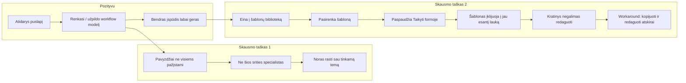

# Vartotojo kelionės analizė – iš naudotojo atsiliepimo

**Šaltinis:** atsiliepimas per Messenger (2026-03).  
**Produktas:** DI Operacinis Centras (ditreneris.github.io/ceo/).

---

## 1. Vartotojo kelionė – žingsnis po žingsnio

**Kas vyksta techniškai („Taikyti formoje“):**

1. Vartotojas paspaudžia „Taikyti formoje“ prie pasirinkto šablono.
2. `generator.js` – `applyLibraryPrompt(id)` įrašo **visą šablono tekstą** į dabartinio režimo formos lauką **„Pagrindinis klausimas DI“** (`[name="question"]`).
3. Iškviečiamas `updateOutput()`: sugeneruotas promptas **perrašomas** iš formos duomenų (kontekstas, finansai, faktai + **KLAUSIMAS:** + šablono tekstas).
4. Rezultatas rodomas bloke **„Sugeneruota užklausa“** (`#opsOutput`), kuris yra **`
`** – tik skaityti, redaguoti negalima.

Todėl vartotojas mato **vieną ilgą tekstą**, kuriame sumaišyti:
- operacinio centro struktūra (ROLĖ, KONTEKSTAS, FINANSAI, FAKTAI),
- ir **visas šablono tekstas** po „KLAUSIMAS:“ (su savo instrukcijomis ir placeholder’iais).

Tai ir suvokiama kaip „šioks toks kratinys, kurio negali redaguoti“.

---

## 2. Pozityvus įspūdis (ką išlaikyti)

- **Bendras įspūdis labai geras.** Didelė pagalba atsirenkant ir užpildant workflow modelį.
- Tai patvirtina, kad **režimai (STRATEGINIS / DIENOS / SAVAITĖS)** ir **formos laukai** naudingi; problema – ne koncepcijoje, o konkrečiuose srautuose (pavyzdžiai, šablonų taikymas ir redagavimas).

---

## 3. Skausmo taškas 1: pavyzdžiai ir kontekstas

**Cituojant:**  
*„Konkrečiai su pavyzdžiu šiek tiek nepatogu, kai neesi šios srities specialistas, bet jeigu galėtum susirasti sau tinkamą temą – tada nuostabi pagalba, idealu.“*

**Ką tai reiškia:**

- Placeholder’iai formose (pvz. „Pasiekti 100K MRR per Q2“, „Pvz.: 45 000 €“) ir šablonų tekste ([suma], [sritis], [kanalai]) yra **orientuoti į verslą / finansus**.
- Žmogus, kuris nėra „šios srities specialistas“, sunkiau **prisiriša** prie tų pavyzdžių ir nežino, ar čia jam tinkama vieta.
- Lūkestis: **susirasti sau tinkamą temą** – t.y. lengviau atpažinti „čia man“ (pagal sritį, rolę ar naudojimo atvejį).

**Tobulinimo galimybės (aptariam atskirai):**

| Idėja | Aprašymas | Prioritetas |
|-------|-----------|-------------|
| **A. Srities / rolės pasirinkimas** | Prieš arba po režimo pasirinkimo: „Kokia jūsų sritis?“ (pvz. Pardavimai, Gamyba, Paslaugos, NVO) arba „Jūsų rolė“ (CEO, COO, vadovas). Pagal tai rodyti **kitokius placeholder’ius arba trumpus pavyzdžius** tų pačių laukų. | Vidutinis – reikalauja turinio ir galbūt UI žingsnio. |
| **B. Pavyzdžių „grupės“ pagal temą** | Šablonų bibliotekoje – filtrai arba žymės pagal temą („Finansai“, „Komanda“, „Projektai“, „Asmeninis“). Tas pats galima formos pavyzdžiams: „Rodyti pavyzdžius: Verslas / Projektai / Kasdienybė“. | Vidutinis. |
| **C. Trumpas „Kaip pradėti“ / „Kur man tinkama?“** | Vienas puslapyje arba modale blokas: „Nežinai, nuo ko pradėti? Pasirink: aš planuoju savaitę / analizuoju skaičius / noriu šablono pagal sritį“ – nuorodos į atitinkamą režimą arba šablonus. | Žemas – daugiausia copy + 1–2 nuorodos. |
| **D. Daugiau pavyzdžių tų pačių laukų** | Prie laukų (placeholder arba po lauku) rodyti 2–3 skirtingi pavyzdžiai, pvz. „Pvz.: 100K MRR per Q2“ ir „Pvz.: Padidinti komandos efektyvumą 20%“. | Žemas – tik turinio pakeitimas. |

**Rekomendacija:** pradėti nuo **D** (papildomi pavyzdžiai) ir **C** (vienas aiškus „Kur man tinkama?“ blokas), vėliau svarstyti A/B, jei bus daugiau atsiliepimų apie „ne mano sritis“.

---

## 4. Skausmo taškas 2: „Taikyti formoje“ ir sugeneruota užklausa

**Cituojant:**  
*„Nulindau į šablonų biblioteką ir pasirinkau mane dominantį šabloną, paspaudžiau ‚Taikyti formoje‘ – tai į jau esantį tekstą lauke ‚sugeneruota užklausa‘ įklijavo šablono tekstą ir gavosi šioks toks kratinys, kurio negali redaguoti. Tenka nusikopijuoti ir tik tada atskirai redaguotis.“*

**Techninė esmė:**

- „Sugeneruota užklausa“ **nėra** atskiras laukas, į kurį tiesiog įklijuojamas šablonas. Sistema:
  1. Įrašo šabloną į **formos lauką** „Pagrindinis klausimas DI“ (arba atitinkamą `question` lauką režime).
  2. Iš **visų** formos laukų (tikslas, finansai, faktai, **question**) vėl **sugeneruoja** pilną promptą.
  3. Rezultatas rodomas **`
`** – tik skaityti (`textContent`), redaguoti negalima.

Todėl:

- Vartotojas **mato** vieną didelį bloką su sumaišyta struktūra (operacinis centras + visas šablono tekstas po „KLAUSIMAS:“).
- Jis **negali** to teksto redaguoti vietoje – tik kopijuoti ir taisyti kitoje programoje.

**Tobulinimo galimybės (aptariam atskirai):**

| Idėja | Aprašymas | Prioritetas |
|-------|-----------|-------------|
| **1. Redaguojamas išvesties laukas** | „Sugeneruota užklausa“ padaryti **redaguojamu** (pvz. `<textarea>` arba `contenteditable` blokas), sinchronizuotu su kopijavimu. Vartotojas gali pataisyti tekstą vietoje, o „Kopijuoti“ kopijuoja redaguotą versiją. | **Aukštas** – tiesiogiai išsprendžia „negali redaguoti“. |
| **2. „Taikyti“ semantika: pakeisti ar pridėti** | Aiškiai apibrėžti: **A)** „Taikyti formoje“ = pildo tik **klausimo lauką** (dabar taip ir yra), bet **B)** vartotojui parodyti, kad keičiamas būtent **klausimo laukas** (pvz. „Šablonas įrašytas į lauką ‚Pagrindinis klausimas DI‘. Galite jį redaguoti formoje.“). Arba pasiūlyti **C)** „Naudoti tik šabloną“ – sugeneruota užklausa **tik** iš šablono (be ROLĖ/KONTEKSTAS/FINANSAI), kad nebūtų kratinio. | **Aukštas** – C variantas sumažina kratinio pojūtį. |
| **3. Perspėjimas prieš perrašymą** | Jei lauke „Pagrindinis klausimas DI“ jau yra tekstas: prieš taikant šabloną rodyti „Šis laukas bus perrašytas šablonu. Tęsti?“ (Tęsti / Atšaukti). | Vidutinis. |
| **4. Preview prieš taikymą** | Mygtukas „Peržiūrėti“ prie šablono: parodyti, **kaip atrodys** sugeneruota užklausa po „Taikyti“ (su dabartiniais formos duomenimis). Vartotojas gali atšaukti arba taikyti. | Vidutinis. |
| **5. Du režimai: „Su kontekstu“ ir „Tik šablonas“** | „Taikyti formoje“ → pasirinkimas: **„Į klausimo lauką“** (dabartinis elgesys) arba **„Tik šablonas į išvestį“** – į opsOutput (arba į redaguojamą lauką) eina **tik** šablono tekstas, be ROLĖ/KONTEKSTAS. Tada vartotojas gali redaguoti ir pridėti kontekstą ranka, jei nori. | Aukštas – du aiškūs keliai. |

**Rekomendacija:**  
- **Būtina:** 1 (redaguojama išvestis) arba 5 („Tik šablonas“), kad būtų galima redaguoti ir išvengti kratinio.  
- **Papildomai:** 2B (aiškus copy, kad keičiamas klausimo laukas) ir 3 (perspėjimas, jei laukas ne tuščias).

**Mikro pataisymai (įgyvendinti):**  
- Po „Taikyti formoje“ – toast: „Šablonas įrašytas į klausimo lauką. Redaguokite formoje pagal poreikius.“; scroll į klausimo lauką ir focus.  
- Bibliotekos kortelėje – užuomina: „Įrašo į lauką ‚Pagrindinis klausimas DI‘ – redaguokite formoje.“  
- Prie „Sugeneruota užklausa“ – tekstas: „Redaguoti galite formos laukuose – rezultatas atsinaujina automatiškai. Nukopijuok ir įklijuok…“  
Taip sumažinamas „šoko“ efektas: vartotojas iš karto mato, kur pateko šablonas ir kad redagavimas vyksta formoje.

---

## 5. Santrauka ir prioritetai

| Problema | Kas skausmas | Top tobulinimas |
|----------|----------------|------------------|
| Pavyzdžiai ne visiems | Ne specialistas nesupranta / neprisiriša | Daugiau pavyzdžių + „Kur man tinkama?“ (copy / nuorodos); vėliau – sritis ar tema. |
| Šablonas → kratinys | Šablonas į klausimo lauką, išvestis = kontekstas + šablonas; div neredaguojamas | Redaguojamas išvesties laukas **arba** „Tik šablonas“ į išvestį; aiškus copy apie tai, kas keičiama. |

**Kiti žingsniai:**

- Atsakyti vartotojui (pvz. per Messenger): padėkos už atsiliepimą, trumpai paaiškinti, kad „Taikyti formoje“ pildo **klausimo lauką**, o sugeneruota užklausa kol kas neredaguojama – ir kad tai tobuliname.
- Į **todo.md** arba backlog įrašyti: (1) redaguojama išvestis arba „Tik šablonas“, (2) perspėjimas prieš perrašant klausimo lauką, (3) pavyzdžių / „Kur man tinkama?“ patobulinimai.

---

## Nuorodos

- [generator.js](../generator.js) – `applyLibraryPrompt`, `updateOutput`, `getGeneratedPrompt`, `buildMasterPrompt` (ir kt.).
- [index.html](../index.html) – `#opsOutput` (div, eil. ~238).
- [docs/MOBILE_UX_IMPROVEMENT_PLAN.md](MOBILE_UX_IMPROVEMENT_PLAN.md) – mobile hierarchija ir fokusavimas.
