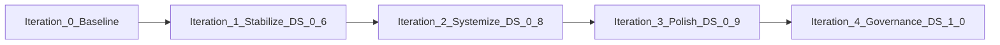

# Design System Improvement Plan — Iterations

**Status:** Complete (DS 1.1 Hardened shipped 2026-05-22; 1.4b mobile DOM deferred per spike)  
**Last updated:** 2026-05-22  
**Current DS version:** 1.1 (Hardened)  
**Previous baseline:** 0.5 (Documented Drift) — closed 2026-05-22  
**Priority:** P1 — after Phase 15–17 launch blockers ([`todo.md`](../todo.md))

**Owner lanes:** UI/UX (storefront CSS/HTML) · Orchestrator (SOT/commerce sign-off) · QA (`npm test`, `npm run test:mixed`)

**Related docs:**

| Doc | Role |
|-----|------|
| [`docs/STYLEGUIDE.md`](STYLEGUIDE.md) | Brand + PDF print SOT |
| [`gold_legacy_standard.md`](../gold_legacy_standard.md) | Premium UI/PDF/commerce baseline |
| [`docs/CURRENT_TRUTH.md`](CURRENT_TRUTH.md) | Canonical product facts |
| [`docs/MOBILE_UX_IMPROVEMENT_PLAN.md`](MOBILE_UX_IMPROVEMENT_PLAN.md) | Mobile hierarchy (partially shipped) |
| [`AGENTS.md`](../AGENTS.md) | EN-first policy, agent lanes |

---

## 0. How to use this document

1. Pick the **next open iteration** (start with **Iteration 1** unless tokens are already fixed).
2. Complete tasks in order within the iteration; do not skip QA gates.
3. Mark checkboxes in [§11 Tracking](#11-tracking) and add a `CHANGELOG.md` `## DS x.y` entry when an iteration exits.
4. Do **not** expand LT copy or change Stripe/fulfillment in DS iterations.

---

## 1. Executive summary

The Prompt Anatomy CEO storefront has a **real design foundation**: CSS custom properties in [`style.css`](../style.css), governance in [`docs/STYLEGUIDE.md`](STYLEGUIDE.md), and copy/commerce in [`config/sot.json`](../config/sot.json). Visually it reads as a credible CEO tool, not a generic template.

**The problem:** documentation describes a mature system, but **runtime CSS bypasses tokens**. Roughly 98 hardcoded hex values, ~100 bespoke `box-shadow` declarations, 38 unique `font-size` values, and three **undefined** variables (`--primary-dark`, `--shadow-cta`, `--space-10`) create micro-inconsistencies that reduce premium SaaS perception and slow safe scaling.

**One-sentence diagnosis:** *Tokens exist; the codebase does not consistently honor them.*

**Scaling readiness:** **Not ready** until Iteration 2 exits (DS 0.8). Safe to ship launch blockers in parallel; zero-risk token fixes (Iteration 1.1) can land anytime.

---

## 2. Baseline metrics (audit snapshot)

Measured against [`style.css`](../style.css) and [`index.html`](../index.html) as of 2026-05-22.

| Metric | Value | Target (DS 0.8) |
|--------|-------|-----------------|
| CSS file size | ~2,367 lines, single file | Partitioned 5 files |
| Raw hex literals | ~98 | 0 outside `tokens.css` |
| `box-shadow` declarations | ~100 | Use 5 shadow tokens |
| Unique `font-size` values | ~38 | ≤12 via type scale |
| Unique `border-radius` values | ~58 | 4 radius tokens |
| Button-like patterns | ~14 classes | 4 base + modifiers |
| Card-like containers | ~11 patterns | 3 surface types |
| Undefined CSS vars | 3 (`--primary-dark`, `--shadow-cta`, `--space-10`) | 0 |

**Defined tokens (good):** `--primary`, `--accent-gold`, `--space-4`…`48`, `--r-card`/`btn`/`badge`/`hero`, `--shadow-soft`/`medium`/`elevated`, `--surface-0`…`3`, motion tokens, icon sizes.

**Page IA (frozen):** Hero → Operations Center → PDF Guides → Library → Rules → Community → Footer.

---

## 3. Version map

| Version | Name | What it means |
|---------|------|----------------|
| **0.5** | Documented Drift | Tokens + docs exist; CSS drifts (current) |
| **0.6** | Stabilized | No silent bugs; hero/CTA hierarchy clear |
| **0.8** | Consolidated | `.btn` + `.card` + type scale; CSS partitioned |
| **0.9** | Conversion-polished | Trust row, price hierarchy, paid section cohesion |
| **1.0** | Governed | `DESIGN-SYSTEM.md`, CI hex lint, frozen component rules |

### What changes across iterations

- Token coverage, component taxonomy, hero density, trust UI, CSS structure, CI guards.

### What never changes (without explicit product decision)

- Brand colors: violet `#4A148C`, amber `#FFB300`
- Fonts: Inter, JetBrains Mono
- EN-US copy policy; `/lt/` regression-only
- Stripe checkout URLs and fulfillment flow
- PDF cover anatomy (5 slots per [`STYLEGUIDE.md`](STYLEGUIDE.md))
- JSON-LD, skip link, `:focus-visible`, `prefers-reduced-motion`

---

## 4. Iterations

### Iteration 0 — Baseline (complete)

**Goal:** Capture audit state and approve execution plan.  
**Timebox:** 0 dev days (documentation only).  
**Exit criteria:** This file approved; Iteration 1 scheduled.

- [x] Storefront visual + code audit
- [x] DS maturity rated 0.5
- [x] Four-iteration roadmap defined

---

### Iteration 1 — Stabilize → **DS 0.6**

**Goal:** Remove obvious inconsistencies and silent CSS bugs. No new visual language.  
**Timebox:** 1–3 days  
**Theme:** Fix broken vars, align hero, unify primary CTAs, on-grid spacing.

| ID | Task | Files | Effort | QA |
|----|------|-------|--------|-----|
| 1.1 | Add `--primary-dark: #2E0A52`, `--shadow-cta: 0 8px 22px rgba(74,20,140,0.22)`, `--text-muted: #5F6B7C`; add `--space-10: 10px` OR remove all `--space-10` references | `style.css` `:root` | Low | `npm test` |
| 1.2 | Replace top hex offenders with tokens: `#FFFFFF`→`var(--white)`, `#E2E5EF`→`var(--border)`, `#F8F9FC`→`var(--surface-2)`, muted greys→`var(--text-muted)` | `style.css` | Low | visual diff |
| 1.3 | Trim inline first-paint `<style>` in `index.html` (~lines 126–176) to minimal shell; values must match tokens | `index.html` | Low | LCP spot-check |
| 1.4 | Hero above-fold: badge row, h1, one lead line, primary CTA + secondary link, meta — **remove or relocate** 4-step pill row from hero | `index.html`, `style.css` | Medium | `npm run test:e2e` |
| 1.5 | Unify primary CTA: same shadow, radius, min-height on `.cta-button`, `.pdf-guide-cta`, `.community-cta-primary` | `style.css` | Low | 375px mobile |
| 1.6 | Replace ad-hoc gaps (`14px`, `18px`, `10px`, `6px`) with nearest `--space-*` | `style.css` | Low | — |
| 1.7 | `npm run build` → regenerate `en/index.html`, `lt/index.html` | `scripts/build-locale-pages.js` | Low | `npm test` |

**Exit criteria:**

- [x] No reference to undefined CSS variables
- [x] Hero shows one obvious primary action on mobile
- [x] `npm test` green
- [x] `CHANGELOG.md` entry: `## DS 0.6`

**Do not duplicate:** Mobile CTA/shadow/badge work already done — see [§12 Mobile cross-reference](#12-mobile-cross-reference).

---

### Iteration 2 — Systemize → **DS 0.8**

**Goal:** Repeated UI decisions become reusable tokens and components.  
**Timebox:** 3–7 days  
**Theme:** Type scale, `.btn`, `.card`, `.trust-row`, CSS partition, CI guard.

| ID | Task | Files | Effort | QA |
|----|------|-------|--------|-----|
| 2.1 | Type scale in `:root`: `--text-xs` 11px, `--text-sm` 13px, `--text-base` 15px, `--text-md` 16px, `--text-lg` 17px, `--text-xl` 20px, `--text-2xl` 22px, `--text-3xl` 28px, `--text-hero` 38px; migrate top 20 usages | `style.css` | Medium | ≤12 unique sizes |
| 2.2 | `.btn` base + `--primary`, `--secondary`, `--ghost`, `--pill`, `--icon`; keep old class names as aliases one release | `style.css`, `index.html` | Medium | e2e CTAs |
| 2.3 | `.card`, `.card--product`, `.card--surface-dark`; migrate ops-form, library, sessions, pdf-guide | `style.css` | Medium | — |
| 2.4 | `.trust-row` component; `copy.trust` in SOT; hydrate in `commerce.js` | `sot.json`, `commerce.js`, `index.html`, `style.css` | Medium | structure tests |
| 2.5 | `.chip` unifies `.badge`, `.pill`, `.tag` (aliases retained) | `style.css` | Low | — |
| 2.6 | Partition: `styles/tokens.css`, `base.css`, `components.css`, `sections.css`, `responsive.css`; `style.css` imports all | new `styles/` | Medium | build OK |
| 2.7 | Structure test or `lint:css`: fail on `#hex` outside `tokens.css` | `tests/structure.test.js` | Low | CI |

**Exit criteria:**

- [ ] New UI section buildable with `.btn` + `.card` only
- [ ] [`docs/STYLEGUIDE.md`](STYLEGUIDE.md) appendix: storefront components
- [ ] `CHANGELOG.md` entry: `## DS 0.8`

---

### Iteration 3 — Premium polish → **DS 0.9**

**Goal:** Conversion clarity and perceived value without rebrand.  
**Timebox:** 1–2 weeks  
**Theme:** Trust, pricing, paid section cohesion.

| ID | Task | Files | Effort | QA |
|----|------|-------|--------|-----|
| 3.1 | Deploy `.trust-row` on both PDF cards + optional section footer | `index.html`, `style.css` | Medium | High impact |
| 3.2 | `.price__now` / `.price__was` hierarchy (larger now, smaller strikethrough) | `style.css` | Low | — |
| 3.3 | Tighten `.pdf-compare-strip` typography and divider | `style.css`, optional `sot.json` | Low | — |
| 3.4 | Single upsell in ops-output footer → `#pdf-guides` (SOT copy) | `index.html`, `sot.json` | Low | — |
| 3.5 | Three “what you get” bullets above price on PDF cards (SOT/TOC-driven) | `commerce.js`, `index.html` | Medium | — |
| 3.6 | Contrast audit: `--text-light` on all backgrounds | `style.css` | Low | `npm run test:a11y` |
| 3.7 | Optional Playwright visual snapshots (hero, pdf-guides, 375px) | `tests/e2e/` | High | regression |

**Exit criteria:**

- [ ] Paid block reads as one premium offer
- [ ] pa11y contrast clean on storefront
- [ ] `CHANGELOG.md` entry: `## DS 0.9`

---

### Iteration 4 — Governance → **DS 1.0**

**Goal:** Freeze system; agents implement from docs alone.  
**Timebox:** 2–3 days  

| ID | Task | Output |
|----|------|--------|
| 4.1 | Write `docs/DESIGN-SYSTEM.md` (tokens + components + examples) | new file |
| 4.2 | Write `docs/COMPONENT-RULES.md` (contribution rules) | new file |
| 4.3 | Update `docs/CURRENT_TRUTH.md` with DS version line | truth doc |
| 4.4 | Update `gold_legacy_standard.md` DS section if tokens changed | baseline |
| 4.5 | Mark all iterations complete in this file; archive open questions | this file |

**Exit criteria:**

- [ ] Hex lint enforced in CI
- [ ] `CHANGELOG.md` entry: `## DS 1.0`

---

## 5. OK / FAIL matrix

| Area | OK | FAIL | Impact | Priority |
|------|----|------|--------|----------|
| Typography | Inter + mono; hero hierarchy | 38 font-sizes; no type scale | High | P0 |
| Colors | Token palette in `:root` | ~98 hex bypass; 3 undefined vars | High | P0 |
| Spacing | `--space-4`…`48` | Missing `--space-10`; ad-hoc gaps | Medium | P1 |
| Layout rhythm | 1120px container | Inconsistent section margins | Medium | P1 |
| Cards | Recognizable soft cards | 11 competing card recipes | High | P0 |
| Buttons / CTAs | Strong primary; focus rings | 14+ button patterns | High | P0 |
| Icons | Lucide + size tokens | Minor hardcoded icon colors | Low | P3 |
| Shadows / radius | 5 shadow tokens defined | ~100 bespoke shadows; 58 radii | High | P0 |
| Mobile | Breakpoints 768/480; CTA stack | Hero still dense; ops panel heavy | High | P1 |
| Content density | Clear ops job | Hero 11 elements; footer noisy | High | P0 |
| Hero | Strong headline + price anchor | 3 subheaders + 4-step pills | High | P0 |
| Pricing / offer | 2-card grid; compare strip | Trust as plain text; tall mobile cards | High | P0 |
| Trust / proof | Stripe/refund/address present | No visual trust component | High | P1 |
| Multilingual | EN canonical; build script | LT frozen (correct per policy) | Low | — |
| Component reuse | Collapsible, pills, icons | No BEM/component CSS files | High | P1 |
| Code maintainability | SOT + CI | 2367-line monolith CSS | Medium | P1 |

---

## 6. Component consolidation map

### Buttons → 4 roles

| Current classes | Target | Notes |
|-----------------|--------|-------|
| `.cta-button`, `.community-cta-primary`, `.pdf-guide-cta` | `.btn.btn--primary` | One shadow recipe |
| `.cta-button-outline`, `.community-cta-secondary`, `.pdf-guide-preview-btn` | `.btn.btn--secondary` | Outline/ghost |
| `.top-nav-playbooks-link`, `.top-nav-copy-btn`, `.library-btn`, `.session-btn` | `.btn.btn--ghost` | Nav/utility |
| `.mode-tab`, `.depth-btn` | `.btn.btn--pill` | Segmented controls |
| `.ops-output-copy` | `.btn.btn--icon` | Icon-only 44×44 |

### Cards → 3 surfaces

| Current | Target |
|---------|--------|
| `.ops-form-section`, `.library-card`, `.ops-sessions`, `.session-item`, `.rules-item` | `.card` |
| `.pdf-guide-card`, `.pdf-guides-section` inner | `.card.card--product` |
| `.ops-output` | `.card.card--surface-dark` |

### Chips → one family

| Current | Target |
|---------|--------|
| `.badge`, `.pill`, `.tag` | `.chip` + `--info`, `--premium`, `--success` |

### Proposed type scale

| Token | Size | Use |
|-------|------|-----|
| `--text-xs` | 11px | eyebrows, micro |
| `--text-sm` | 13px | help, metadata |
| `--text-base` | 15px | UI body |
| `--text-md` | 16px | body |
| `--text-lg` | 17px | hero lead |
| `--text-xl` | 20px | section title |
| `--text-2xl` | 22px | h2 |
| `--text-3xl` | 28px | secondary hero |
| `--text-hero` | 38px | h1 |

---

## 7. File ownership

| File / area | Inspect | Improve | Risk | Benefit |
|-------------|---------|---------|------|---------|
| [`style.css`](../style.css) | Hex, shadows, buttons, cards | Tokens, partition, components | Medium | Highest |
| [`index.html`](../index.html) | Hero, inline CSS, PDF section | Hero trim, trust row markup | Low–Med | Conversion |
| [`en/index.html`](../en/index.html), [`lt/index.html`](../lt/index.html) | Generated drift | Rebuild after HTML changes | Low | Consistency |
| [`config/sot.json`](../config/sot.json) | `copy.*`, `commerce` | `copy.trust`, upsell strings | Low | SOT-driven UI |
| [`commerce.js`](../commerce.js) | Hydration, trust, bullets | Trust row + card bullets | Low | Maintainability |
| [`generator.js`](../generator.js) | Library DOM | No inline styles | Low | Separation |
| [`scripts/build-locale-pages.js`](../scripts/build-locale-pages.js) | Locale output | Run after `index.html` | Low | EN/LT sync |
| [`tests/structure.test.js`](../tests/structure.test.js) | Asset tests | Hex lint, DS guards | Low | Regression |
| [`tests/e2e/core-flow.spec.js`](../tests/e2e/core-flow.spec.js) | Flows | Visual snapshots (3.7) | Medium | Visual CI |
| [`docs/pdf-source/pdf-print.css`](../docs/pdf-source/pdf-print.css) | PDF tokens | Align shared color names only | Low | Brand unity |

**Lane rule ([`AGENTS.md`](../AGENTS.md)):** UI/UX owns `index.html` + `style.css`; Orchestrator owns `sot.json` commerce; Content owns copy in SOT.

---

## 8. Do-not-touch list

- Violet `#4A148C` and amber `#FFB300` brand palette
- Inter + JetBrains Mono font stack
- `config/sot.json` commerce URLs and `allowPlaceholderCheckout` behavior
- Static Stripe `href` fallbacks in HTML
- JSON-LD blocks in `index.html`
- Skip link, `:focus-visible`, ARIA tab/radio/dialog patterns, `prefers-reduced-motion`
- PDF cover 5-element anatomy and gold `strong` on violet covers
- [`lt/index.html`](../lt/index.html) — regression only; no LT copy expansion
- Phase 15–17 launch checklist items — do not defer for DS work

**Copy that already works (do not rewrite for polish):**

- Hero h1: “Turn KPIs into weekly priorities”
- Compare strip: coach $500+ vs $9.99 / $19.99
- Ops output hint: paste into ChatGPT, Claude, or Gemini

---

## 9. Documentation deliverables (by iteration)

| Document | When | Contents |
|----------|------|----------|
| **This file** | Now | Iterations, tracking, cross-refs |
| [`docs/DESIGN-SYSTEM.md`](DESIGN-SYSTEM.md) | After Iteration 4 | Full token tables + HTML examples |
| [`docs/COMPONENT-RULES.md`](COMPONENT-RULES.md) | After Iteration 4 | Rules for new components |
| [`docs/COPY-GLOSSARY.md`](COPY-GLOSSARY.md) | Optional at 1.0 | CTA verbs, banned phrases, product names |
| [`docs/MOBILE-AUDIT.md`](MOBILE-AUDIT.md) | Optional at 0.8 | Section checklist 320/375/768 |
| [`CHANGELOG.md`](../CHANGELOG.md) | Each iteration exit | `## DS 0.6` / `0.8` / `0.9` / `1.0` |

[`docs/STYLEGUIDE.md`](STYLEGUIDE.md) stays PDF/OG-focused; storefront components live in `DESIGN-SYSTEM.md` after Iteration 4.

---

## 10. Low-hanging fruits (top 15)

| # | Fix | Why | Effort | Impact |
|---|-----|-----|--------|--------|
| 1 | Add missing tokens (`--primary-dark`, `--shadow-cta`, `--text-muted`) | Fixes silent CSS bugs | Low | Medium |
| 2 | Hex → token mechanical pass | Removes ~40% drift | Low | High |
| 3 | Hero: 5 elements above fold | Highest conversion ROI | Low | High |
| 4 | Unified `--text-muted` for grey copy | Visual rhythm | Low | Medium |
| 5 | One primary button recipe for all buy CTAs | Trust + clarity | Medium | High |
| 6 | Price block: bigger now, smaller was | Anchor pricing | Low | Medium |
| 7 | `.trust-row` with Lucide icons | Cold-traffic purchase confidence | Medium | High |
| 8 | Spacing tokens for all gaps | Rhythm | Low | Medium |
| 9 | Shrink inline first-paint CSS | Stops token drift | Low | Medium |
| 10 | Type scale (9 steps) | Hierarchy | Medium | High |
| 11 | Merge outbound links (publisher vs community) | Less distraction from PDFs | Low | Medium |
| 12 | Footer FAQ collapsed on desktop | Less noise | Low | Low |
| 13 | Stripe/lock icons in trust row | Visual proof | Low | High |
| 14 | pa11y contrast pass | a11y + polish | Low | Medium |
| 15 | CI hex lint outside `tokens.css` | Prevents regression | Low | High (long-term) |

---

## 11. Tracking

### Iteration 0 — Baseline

- [x] Audit complete
- [x] Plan documented

### Iteration 1 — Stabilize (DS 0.6)

- [x] 1.1 Missing tokens
- [x] 1.2 Hex → token pass
- [x] 1.3 Inline first-paint trim
- [x] 1.4 Hero density (steps → ops center; **1.4b DOM reorder OUT**)
- [x] 1.5 Primary CTA unify
- [x] 1.6 Spacing on-grid
- [x] 1.7 `npm run build` + `npm test`

### Iteration 2 — Systemize (DS 0.8)

- [x] 2.1 Type scale
- [x] 2.2 `.btn` system
- [x] 2.3 `.card` system
- [x] 2.4 `.trust-row` + SOT
- [x] 2.5 `.chip` merge
- [x] 2.6 CSS partition
- [x] 2.7 CI hex lint (`components.css`, `sections.css`, `base.css`, `responsive.css` — hex only in `tokens.css`)

### Iteration 3 — Premium polish (DS 0.9)

- [x] 3.1 Trust row deployed
- [x] 3.2 Price hierarchy
- [x] 3.3 Compare strip
- [x] 3.4 Ops upsell line
- [x] 3.5 PDF card bullets
- [x] 3.6 Contrast pass (`npm run test:a11y` — manual release gate)
- [x] 3.7 Visual snapshots (`npm run test:visual`)

### Iteration 4 — Governance (DS 1.0)

- [x] 4.1 `DESIGN-SYSTEM.md`
- [x] 4.2 `COMPONENT-RULES.md`
- [x] 4.3 `CURRENT_TRUTH.md` update
- [x] 4.4 `gold_legacy_standard.md` sync
- [x] 4.5 Plan marked complete

---

## 12. Mobile cross-reference

[`docs/MOBILE_UX_IMPROVEMENT_PLAN.md`](MOBILE_UX_IMPROVEMENT_PLAN.md) (2026-03) targeted mobile hierarchy. **Do not re-implement** completed items.

| Mobile plan item | Status | DS plan action |
|------------------|--------|----------------|
| 1 primary CTA on mobile | Done (`style.css` @768px) | Keep; extend to desktop hero in **1.4** |
| Depth inline / segmented | Done | — |
| Less violet on mode/depth tabs | Done | — |
| Step padding reduced | Done | — |
| Horizontal stepper on mobile | Done | **1.4** may remove hero steps entirely |
| Badge noise (hide spin-off) | Done | — |
| Shorter micro copy | Done | — |
| Softer shadows on mobile | Done | **2.x** unify shadow tokens globally |
| Hierarchy DOM order (#8) | **Spike only** | [`docs/DS_MOBILE_DOM_SPIKE.md`](DS_MOBILE_DOM_SPIKE.md) — implement after sign-off |

**Open decision (from mobile plan):** Should mobile/desktop use structural order “Mode → Depth → Form → CTA” via HTML reorder or CSS `order`? Impacts `#operationsCenter` anchors and `generator.js`. Track as **optional 1.4b** — not required for DS 0.6 exit.

---

## 13. First week recommendation

If only five tasks this week (and launch allows):

1. **1.1** — Add missing tokens (15 min)
2. **1.2** — Hex → token pass (1–2 h)
3. **1.4** — Hero density (1 h)
4. **1.5** — Primary CTA unify (30 min)
5. **1.7** — `npm run build` + `npm test`

**Postpone until after launch:** Iteration 3 conversion experiments, visual snapshots, full CSS partition (unless a dev week is dedicated).

---

## 14. Out of scope

- LT localization development
- New color palette or fonts
- Stripe / fulfillment / Vercel env changes
- PDF content rewrites (21/43 pages)
- Full mobile DOM reorder without explicit sign-off
- Dark mode toggle
- WebP / satori OG (see [`todo.md`](../todo.md) P2)

---

## 15. Success definition

A founder or dev can open this file, execute **Iteration 1.1** in one afternoon, and know objectively when the repo reaches **DS 0.8** (new sections use `.btn` + `.card` only, CI blocks hex drift) and **DS 1.0** (documented, frozen, agent-ready).

---

## 16. DS 1.1 hardening backlog (complete)

| Item | Status |
|------|--------|
| 3.7 Playwright visual snapshots | Done |
| Shadow token migration | Done |
| Type scale `font-size` → `var(--text-*)` | Done |
| LCP inline shell ↔ `tokens.css` | Done |
| HTML `.btn` markup on all storefront CTAs | Done |
| CI: shadow / type / visual spec guards | Done |
| Smoke: PDF guides + trust row + preview | Done |
| 1.4b mobile DOM | Spike doc only — [`DS_MOBILE_DOM_SPIKE.md`](DS_MOBILE_DOM_SPIKE.md) |
| Hero refactor (post–DS 1.1) | [`hero_refactor.md`](hero_refactor.md) — 2 CTA, glass card, scroll spy |

---

*Derived from storefront design system audit, 2026-05-22. Aligns with [`gold_legacy_standard.md`](../gold_legacy_standard.md) v1.1.0 baseline.*
