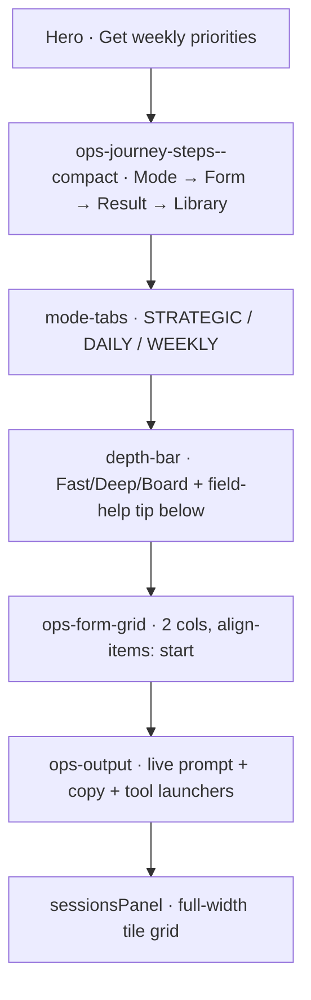

# Ops workspace clarity — DOM contract & journey

**Status:** Shipped 2026-05-22 · **Scope:** `#operationsCenter` only · **Policy:** EN-first ([`AGENTS.md`](../AGENTS.md))

Companion to [`docs/hero_refactor.md`](hero_refactor.md). Documents the SOT keys, DOM contract, and CEO journey assumptions that the ops workspace clarity pass introduced. The implementation plan lives in `.cursor/plans/ops_workspace_premium_*.plan.md`.

## CEO first-run journey



| Time | What the user understands |
|------|---------------------------|
| 30s  | "Choose mode, fill context, copy brief." |
| ~5min | Prompt is copied; optional save session or open ChatGPT/Claude/Gemini. |

## DOM contract

| Element | Selector / id | Purpose |
|---------|---------------|---------|
| Section | `#operationsCenter` | Anchor target from hero + step 1 |
| Stepper | `.ops-journey-steps.ops-journey-steps--compact` | 4 anchors with scroll spy ([`copy.js`](../copy.js)) |
| Mode tabs | `.mode-tabs > .mode-tab[data-mode]` | `MASTER` / `DIENOS` / `SAVAITES` panels |
| Depth bar | `.depth-bar` | Depth pills only (no nested tip chip) |
| Depth tip | `#depthTip.field-help.depth-tip` below `.depth-bar` | `aria-describedby` target on depth `radiogroup`; `[data-copy-ops-depth-tip]` for hydration |
| Form grid | `.ops-form-grid` | `align-items: start`; full-width help via `.field-help--row` |
| Output | `#opsOutput` (textarea) | SOT placeholder; min-height 140px; themed scrollbar |
| Tool launchers | `.ops-tool-btn[data-ai-tool]` | Ghost on dark surface; gold accent on hover/focus |
| Sessions | `#sessionsPanel` | **Sibling of `.ops-layout`** (not inside `.ops-sidebar`); full-width tile grid |
| Toast | `#toast[data-copy-ops-toast-default]` | `showToastIfAvailable` reads attribute as default |

**Anchors that must not break:** `#operationsCenter`, `#opsForm`, `#opsOutputSection`, `#library` (covered by [`tests/e2e/core-flow.spec.js`](../tests/e2e/core-flow.spec.js)).

## SOT keys

```json
"copy": {
  "opsCenter": {
    "title": "Build your weekly brief"
  },
  "opsDepth": {
    "tip": "Not sure? Start with Fast."
  },
  "opsOutput": {
    "emptyPlaceholder": "Your CEO-ready operating brief appears here as you fill the form.",
    "copiedToast": "Brief copied — paste the structured prompt into ChatGPT, Claude, or Gemini."
  }
}
```

Hydration lives in [`commerce.js`](../commerce.js) → `initHeroCopy` (extended). The build replaces the EN strings for the LT regression page in [`scripts/build-locale-pages.js`](../scripts/build-locale-pages.js); LT marketing copy is not vested with new content per [`AGENTS.md`](../AGENTS.md).

## Quality gates

```bash
npm test                 # structure tests (~144)
npm run build            # regenerate /en/ + /lt/ after HTML touches
npm run test:e2e         # core flow incl. sessions + step links
npm run test:a11y        # depth tip aria-describedby, form labels
npm run test:visual:update   # after intentional ops-center DOM/CSS change
```

Visual baselines in [`tests/e2e/__screenshots__/`](../tests/e2e/__screenshots__/):

- `ops-center-desktop.png` (1280px viewport)
- `ops-center-mobile.png` (375px viewport)

## What is explicitly out of scope

- Stripe / fulfillment / PDF source HTML.
- LT marketing copy (LT regression only — strings replaced at build).
- New modes, API calls, wizard / multi-page flow.
- Hero or PDF storefront layout (already polished).

## Follow-ups (not in this PR)

- **Phase C** — migrate ops surfaces to `.btn` / `.card` aliases per [`docs/ds_improvement_plan.md`](ds_improvement_plan.md) §2.3.
- **Phase D** — first-run polish (ready-to-copy badge, soft quality hint, mobile DOM order spike) gated on Phase 17 QA.
