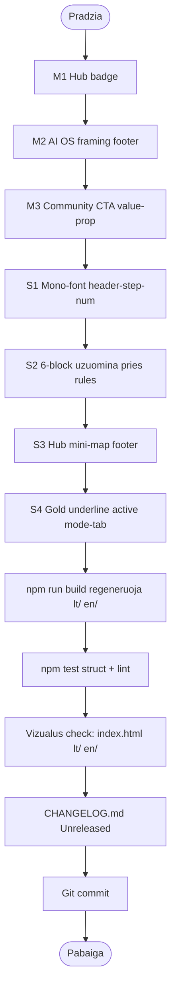

# Pre-deploy planas (Vercel)

Brand alignment MUST + SHOULD planas ir galutinis pre-deploy checklist'as prieš production deploy į Vercel.

**Statusas:** Planavimas. Kodo įgyvendinimas — atskiras komitas po šio dokumento patvirtinimo.

---

## 1. Tikslas ir kontekstas

### Jau atlikta (nereikia perdaryti)

- **Vercel deploy konfigūracija:** `vercel.json` (cleanUrls, trailingSlash, cache headers) + `.vercelignore`. Dual deploy mode su esamu GitHub Pages workflow.
- **WhatsApp → Telegram migracija:** community CTA pakeista į `https://t.me/prompt_anatomy` visose 5 vietose (LT/EN, root + locale buildai + runtime + build replace skripte).
- **`npm test` + `npm run build`:** žali (53/53 struct testai, ESLint, html-validator).

### Dabar planuojama

Brand alignment su motininės svetainės `promptanatomy.app` (Promptų anatomija – DI operacinė sistema) pozicijomis:

- Aiškiai matoma lineage į Promptų anatomijos AI OS ekosistemą.
- Vizualinis ir tekstinis derinimas su motininės brand DNA.
- Engineering aesthetic mikroakcentai (mono-font, „01–04" formatas, gold accent).
- Hub modulio („Operations") pozicijos pabrėžimas.

### Ko negriaunam (esmė lieka)

- 3 režimai (STRATEGINIS / DIENOS / SAVAITĖS).
- 3 gylio lygiai (Greita / Gilu / Valdybai).
- 5-min user journey nuo formos iki sugeneruoto prompto.
- Auto-generavimas (forma → output, be „Generate" mygtuko).
- Sesijos sistema (`localStorage`).
- Šablonų biblioteka (`LIBRARY_PROMPTS`).
- LT/EN path-based locale architektūra (Phase 2).
- Golden Standard UI taisyklės.

---

## 2. Brand DNA santrauka

Po motininės svetainės analizės identifikuoti 6 esminiai brand stulpai:

| # | Brand stulpas (Prompt Anatomy) | Pas mus dabar | Statusas |
|---|---|---|---|
| 1 | **AI Operating System** pozicija | „DI Operacinis Centras" – atitinka, bet OS lineage nepabrėžia | Iš dalies |
| 2 | **6-block metodologija** (Meta/Input/Output/Reasoning/Quality/Advanced) | Nėra jokios vizualinės nuorodos | Trūksta |
| 3 | **Engineering aesthetic** (`v1.3_os.sh`, `01. Meta`, code-style) | Nėra | Trūksta |
| 4 | **Hub/Spin-off ekosistema** (4 kryptys: Library/Content/Recruitment/Operations) | „Spin-off Nr. 5" badge be konteksto | Iš dalies |
| 5 | **Spalvos**: violetinė `#4A148C` + auksinė `#FFB300` | Identiška – `--primary: #4A148C`, `--accent-gold: #FFB300` | OK |
| 6 | **Telegram community** kaip oficialus kanalas | Įdiegta (`https://t.me/prompt_anatomy`) | OK |

Šis planas adresuoja stulpus #1, #2, #3, #4 (ko trūksta arba kas iš dalies).

---

## 3. MUST blokas (kritinis lineage)

### M1. Hub badge vietoj „Spin-off Nr. 5"

**Tikslas:** Aiški lineage į Promptų anatomijos Hub ekosistemą. Motininės svetainė pati įvardija mus „Operations center (CEO/COO)".

**Failai ir pakeitimai:**

[`index.html`](../index.html) eil. 47:

```html
<!-- prieš -->
<span class="badge badge-spinoff" role="status" aria-label="DI Operacinis Centras, Spin-off Nr. 5">Spin-off Nr. 5</span>

<!-- po -->
<span class="badge badge-spinoff" role="status" aria-label="Promptų anatomija Hub modulis: Operacijos (CEO/COO)">Hub modulis: Operacijos</span>
```

[`generator.js`](../generator.js) eil. 312–313:

```javascript
if (badgeSpinoff) badgeSpinoff.textContent = uiText('Hub modulis: Operacijos', 'Hub module: Operations');
if (badgeSpinoff) badgeSpinoff.setAttribute('aria-label', uiText('Promptų anatomija Hub modulis: Operacijos (CEO/COO)', 'Prompt Anatomy Hub module: Operations (CEO/COO)'));
```

[`scripts/build-locale-pages.js`](../scripts/build-locale-pages.js) eil. 103–104:

```javascript
html = html.replace('aria-label="Promptų anatomija Hub modulis: Operacijos (CEO/COO)"', 'aria-label="Prompt Anatomy Hub module: Operations (CEO/COO)"');
html = html.replace('>Hub modulis: Operacijos</span>', '>Hub module: Operations</span>');
```

CSS klasė `.badge-spinoff` (gold border) — paliekama, signalizuoja premium ekosistemos akcentą.

---

### M2. AI OS framing footer'yje

**Tikslas:** „AI Operating System" framing = motininės svetainės pagrindinė pozicija.

**Failai ir pakeitimai:**

[`index.html`](../index.html) eil. 343:

```html
<!-- prieš -->
<p class="footer-product-link">Tai Spin-off Nr. 5 iš „Promptų anatomijos".</p>

<!-- po -->
<p class="footer-product-link">Dalis Promptų anatomijos – DI operacinės sistemos. Modulis: Operacinis centras (CEO/COO).</p>
```

[`generator.js`](../generator.js) eil. 554:

```javascript
if (footerProductLink) footerProductLink.textContent = uiText('Dalis Promptų anatomijos – DI operacinės sistemos. Modulis: Operacinis centras (CEO/COO).', 'Part of Prompt Anatomy – the AI Operating System. Module: Operations Center (CEO/COO).');
```

[`scripts/build-locale-pages.js`](../scripts/build-locale-pages.js) eil. 156:

```javascript
html = html.replace('>Dalis Promptų anatomijos – DI operacinės sistemos. Modulis: Operacinis centras (CEO/COO).</p>', '>Part of Prompt Anatomy – the AI Operating System. Module: Operations Center (CEO/COO).</p>');
```

---

### M3. Community CTA value-prop

**Tikslas:** Antrinis community CTA tampa aiškus ekosistemos kvietimas, ne dekoratyvinis link'as.

**Failai ir pakeitimai:**

[`index.html`](../index.html) eil. 336:

```html
<!-- prieš -->
<a href="https://www.promptanatomy.app/" class="community-cta-secondary" target="_blank" rel="noopener noreferrer" aria-label="Pilna Promptų anatomija – interaktyvus mokymas (atidaroma naujame lange)">Promptų anatomija →</a>

<!-- po -->
<a href="https://www.promptanatomy.app/" class="community-cta-secondary" target="_blank" rel="noopener noreferrer" aria-label="Atrask visą Promptų anatomijos AI OS – visus Hub modulius (atidaroma naujame lange)">Atrask visus Hub modulius →</a>
```

[`generator.js`](../generator.js) eil. 543–547:

```javascript
var communitySecondary = document.querySelector('.community-cta-secondary');
if (communitySecondary) {
    communitySecondary.textContent = uiText('Atrask visus Hub modulius →', 'Explore all Hub modules →');
    communitySecondary.setAttribute('aria-label', uiText('Atrask visą Promptų anatomijos AI OS – visus Hub modulius (atidaroma naujame lange)', 'Explore the full Prompt Anatomy AI OS – all Hub modules (opens in new tab)'));
    communitySecondary.setAttribute('href', ANATOMY_URL);
}
```

[`scripts/build-locale-pages.js`](../scripts/build-locale-pages.js) eil. 83–91 — atnaujinti `aria-label` ir tekstų replace'us atitinkant naujus LT pattern'us.

---

## 4. SHOULD blokas (vizualinis derinimas)

### S1. Mono-font header step prefix („01 02 03 04")

**Tikslas:** Engineering aesthetic atitinkantis motininės 6-block stilių (`01. Meta`, `02. Input`).

**Apimtis:** TIK `.header-step-num` (4 skaičiai hero žingsnių sąraše). Apvalūs `.step-badge` sekcijose paliekami nepaliesti.

[`style.css`](../style.css) — pridėti naujas rules po `.header-step-num` esamų stilių:

```css
.header-step-num {
    font-family: 'JetBrains Mono', ui-monospace, monospace;
    font-variant-numeric: tabular-nums;
    letter-spacing: 0.02em;
}
.header-step-num::before {
    content: "0";
}
```

**Risk:** Žemas. Pure CSS, joks HTML/JS pakeitimas.

---

### S2. 6-block užuomina po taisyklėmis

**Tikslas:** Edukacinis bridge tarp mūsų taisyklių ir motininės metodologijos.

[`index.html`](../index.html) — pridėti po `<ul class="rules-list" id="rulesList">` (rules sekcijoje):

```html
<p class="rules-anatomy-hint">
    Šios taisyklės grindžiamos <a href="https://www.promptanatomy.app/" target="_blank" rel="noopener noreferrer">Promptų anatomijos</a> 6-block metodologija:
    <span class="rules-anatomy-blocks">Meta · Input · Output · Reasoning · Quality · Advanced</span>
</p>
```

[`style.css`](../style.css) — naujas blokas:

```css
.rules-anatomy-hint {
    margin-top: var(--space-16);
    padding-top: var(--space-16);
    border-top: 1px solid var(--border-subtle);
    font-size: 13px;
    color: var(--text-light);
    line-height: 1.5;
}
.rules-anatomy-hint a {
    color: var(--primary);
    text-decoration: underline;
    text-decoration-color: rgba(74, 20, 140, 0.3);
    text-underline-offset: 2px;
}
.rules-anatomy-hint a:hover { text-decoration-color: var(--primary); }
.rules-anatomy-blocks {
    display: inline-block;
    margin-top: 4px;
    font-family: 'JetBrains Mono', ui-monospace, monospace;
    font-size: 12px;
    color: var(--primary);
    font-weight: 600;
}
```

[`generator.js`](../generator.js) — pridėti uiText į `applyStaticLocaleText()`:

```javascript
var rulesHint = document.querySelector('.rules-anatomy-hint');
if (rulesHint) {
    var hintLink = rulesHint.querySelector('a');
    if (hintLink) hintLink.textContent = uiText('Promptų anatomijos', 'Prompt Anatomy');
    // Pridėti pilną innerHTML rekonstrukciją per uiText, jei DOM struktūra leidžia
}
```

**Pastaba:** DOM manipuliavimas runtime locale switch'e turi būti atsargus. Galima naudoti `innerHTML` rekonstrukciją per uiText abiems kalboms (žr. rizikos sk. 7).

[`scripts/build-locale-pages.js`](../scripts/build-locale-pages.js) — EN replace pattern'ai:

```javascript
html = html.replace('Šios taisyklės grindžiamos <a', 'These rules follow <a');
html = html.replace('>Promptų anatomijos</a> 6-block metodologija:', '>Prompt Anatomy</a>\u2019s 6-block methodology:');
```

---

### S3. Hub mini-map footer'yje

**Tikslas:** Vizualus ekosistemos „you are here" indikatorius su 4 Hub moduliais.

[`index.html`](../index.html) — pridėti footer sekcijoje po `.tags` div'o, prieš `.copyright`:

```html
<nav class="hub-map" aria-label="Promptų anatomijos Hub moduliai">
    <span class="hub-map-label">Hub:</span>
    <a href="https://www.promptanatomy.app/" class="hub-map-item" target="_blank" rel="noopener noreferrer" data-module="library">Library</a>
    <a href="https://www.promptanatomy.app/" class="hub-map-item" target="_blank" rel="noopener noreferrer" data-module="content">Content</a>
    <a href="https://www.promptanatomy.app/" class="hub-map-item" target="_blank" rel="noopener noreferrer" data-module="recruitment">Recruitment</a>
    <span class="hub-map-item is-active" aria-current="page" data-module="operations">Operations <span class="hub-map-here">jūs čia</span></span>
</nav>
```

[`style.css`](../style.css) — naujas blokas:

```css
.hub-map {
    display: flex;
    flex-wrap: wrap;
    align-items: center;
    gap: 8px;
    margin: var(--space-20) 0 var(--space-16);
    padding: 12px 16px;
    background: var(--surface-2);
    border: 1px solid var(--border-subtle);
    border-radius: var(--r-btn);
    font-size: 13px;
    font-family: 'JetBrains Mono', ui-monospace, monospace;
}
.hub-map-label {
    font-weight: 700;
    color: var(--text-light);
    margin-right: 4px;
}
.hub-map-item {
    padding: 4px 10px;
    border-radius: 8px;
    text-decoration: none;
    color: var(--text-light);
    border: 1px solid transparent;
    transition: color var(--duration-fast), background var(--duration-fast), border-color var(--duration-fast);
}
.hub-map-item:hover {
    color: var(--primary);
    background: var(--surface-1);
}
.hub-map-item.is-active {
    color: var(--primary);
    background: var(--surface-1);
    border-color: var(--accent-gold);
    font-weight: 700;
    cursor: default;
}
.hub-map-here {
    margin-left: 6px;
    padding: 2px 6px;
    border-radius: 4px;
    background: var(--accent-gold-light);
    color: #8A5A00;
    font-size: 10px;
    font-weight: 800;
    letter-spacing: 0.05em;
    text-transform: uppercase;
}
[data-theme="dark"] .hub-map { background: rgba(255, 255, 255, 0.04); }
[data-theme="dark"] .hub-map-item.is-active { background: rgba(74, 20, 140, 0.2); }
```

[`generator.js`](../generator.js) — uiText:

```javascript
var hubHere = document.querySelector('.hub-map-here');
if (hubHere) hubHere.textContent = uiText('jūs čia', 'you are here');

var hubMap = document.querySelector('.hub-map');
if (hubMap) hubMap.setAttribute('aria-label', uiText('Promptų anatomijos Hub moduliai', 'Prompt Anatomy Hub modules'));
```

[`scripts/build-locale-pages.js`](../scripts/build-locale-pages.js):

```javascript
html = html.replace('aria-label="Promptų anatomijos Hub moduliai"', 'aria-label="Prompt Anatomy Hub modules"');
html = html.replace('>jūs čia</span>', '>you are here</span>');
```

**Pastaba:** Modulių pavadinimai („Library", „Content", „Recruitment", „Operations") lieka anglų kalba abiejose locale'se — atitinka motininės terminija.

---

### S4. Gold accent active mode-tab

**Tikslas:** Premium accent su auksiniu indikatoriumi po aktyvia mode-tab'a.

[`style.css`](../style.css) — pridėti / papildyti `.mode-tab.is-active`:

```css
.mode-tab.is-active::after {
    content: '';
    position: absolute;
    left: 50%;
    bottom: -1px;
    transform: translateX(-50%);
    width: 32px;
    height: 2px;
    border-radius: 2px;
    background: var(--accent-gold);
}
```

**Risk patikrinimas:** Reikia įsitikinti, kad `.mode-tab` turi `position: relative`. Jei ne — pridėti `position: relative;` į esamą `.mode-tab` rule'ą.

---

## 5. Vykdymo seka



---

## 6. Validacija

### Automatinė

- `npm run build` — regeneruoja `lt/index.html` ir `en/index.html` su naujais tekstais.
- `npm test` — 53 struktūriniai testai + ESLint + html-validator.
  - Patikrinta: nė vienas testas netikrina „Spin-off" arba senų brand tekstų (žr. `tests/structure.test.js`).
- `npm run test:smoke` (opcionalu) — Playwright smoke testas LT root puslapiui.

### Manualinė

- `index.html` (LT root) — Hub badge hero'jaus dešinėje, naujas footer copy, hub-map prieš copyright, gold underline po aktyvia mode-tab, mono „01 02 03 04" header steps.
- `lt/index.html` ir `en/index.html` — atitinkamai LT/EN tekstai (build artefaktai).
- Telegram nuoroda atidaroma (community-cta-primary).
- Hub-map nuorodos atidaro `promptanatomy.app` naujame tab'e.
- Active „Operations" hub-map item turi auksinį border'ą ir „jūs čia" / „you are here" žymą.

### A11y

- `nav.hub-map` turi `aria-label`.
- Aktyvus „Operations" item turi `aria-current="page"`.
- `aria-label` atnaujinti visiems pakeistiems elementams (badge, footer, community CTA).
- `:focus-visible` veikia visiems naujiems link'ams (paveldima iš esamo CSS).

---

## 7. Rizikos ir mitigacija

| # | Rizika | Mitigacija |
|---|---|---|
| R1 | `.header-step-num` jau turi konfliktinį `font-family` | Patikrinti `style.css` esamus stilius, perrašyti su didesniu specifiškumu jei reikia |
| R2 | `.mode-tab` neturi `position: relative` — `::after` neveiks | Pridėti `position: relative;` jei nebuvo |
| R3 | DOM manipulation `.rules-anatomy-hint` viduje runtime EN switch'e | Naudoti `innerHTML` rekonstrukciją vietoj `textContent` per text node'us, arba palikti EN versiją tik build laiku (kaip kiti `applyStaticLocaleText` elementai) |
| R4 | EN replace pattern neranda LT tekstų (pvz. dėl whitespace skirtumų) | Po `npm run build` patikrinti `en/index.html` su Grep'u, kad nebūtų likę LT tekstų |
| R5 | Hub mini-map per ilgas mažuose ekranuose | `.hub-map` turi `flex-wrap: wrap` — modulių chip'ai persiklos ant naujos eilutės |

---

## 8. Galutinis pre-deploy checklist'as

### Brand alignment darbai

- [ ] M1 Hub badge atliktas (`index.html`, `generator.js`, `build-locale-pages.js`).
- [ ] M2 AI OS framing footer'yje atliktas.
- [ ] M3 Community CTA value-prop atliktas.
- [ ] S1 Mono-font header-step-num atliktas (`style.css`).
- [ ] S2 6-block užuomina po taisyklėmis atlikta.
- [ ] S3 Hub mini-map footer'yje atliktas.
- [ ] S4 Gold accent active mode-tab atliktas.

### Build ir testai

- [ ] `npm run build` praeina, `lt/index.html` ir `en/index.html` regeneruoti.
- [ ] `npm test` 53/53 + lint OK.
- [ ] (Opcionalu) `npm run test:smoke` praeina.

### Vizualus check

- [ ] LT root (`index.html`): Hub badge, footer copy, hub-map, mono header steps, gold mode-tab underline.
- [ ] LT locale (`lt/index.html`): tas pats kaip root.
- [ ] EN locale (`en/index.html`): visi tekstai angliškai (Hub module: Operations, Part of Prompt Anatomy..., Explore all Hub modules, you are here, etc.).
- [ ] Telegram CTA atidaroma `https://t.me/prompt_anatomy`.
- [ ] Hub-map link'ai atidaro `promptanatomy.app` naujame tab'e.

### Dokumentacija ir Git

- [ ] `CHANGELOG.md` `[Unreleased]` papildyta (Pridėta + Pakeista skiltys, žr. plano 5.D sekciją).
- [ ] `git status` švarus.
- [ ] Commit'as su aiškiu žinute (pvz. „brand: align with Prompt Anatomy AI OS — MUST + SHOULD").

### Deploy

- [ ] Push į `main` arba PR.
- [ ] Vercel preview deploy patikrintas (PR preview URL).
- [ ] GitHub Pages deploy nesulūžęs (dual mode).
- [ ] Production deploy į Vercel (po main branch merge).
- [ ] Smoke test live URL: `https://<vercel-domain>/`, `/lt/`, `/en/`.
- [ ] Smoke test GitHub Pages URL (jei dual mode aktyvus).

---

## 9. Rollback strategija

| Kanalas | Rollback'o būdas |
|---|---|
| **Vercel** | Vercel dashboard → Deployments → Promote previous (instant) |
| **GitHub Pages** | `git revert <commit-sha>` arba previous commit deploy via Actions `workflow_dispatch` |
| **Brand pakeitimų local revert** | Visi pakeitimai concentruoti į 4 failus: `index.html`, `generator.js`, `style.css`, `scripts/build-locale-pages.js` — vienas `git revert` komitas + `npm run build` |

**Pastaba:** Kadangi visi brand pakeitimai yra tik tekstai, klasės, CSS — runtime logika nesikeičia, todėl rollback rizika minimali.

---

## 10. Ko nedarom šiame komite (atidedam vėliau)

| Punktas | Priežastis |
|---|---|
| W1 Output anatomy collapsible (6-block mapping ant prompto) | Didelė apimtis, reikia pritaikyti 3 režimams + 3 gyliams. Atskiras komitas. |
| W2 System status indikatorius (`v1.0 · Stable`) | Mažas, bet brand'inis. Galima pridėti vėliau (nice-to-have). |
| W3 Hero copy revizija (LT/EN voice) | Subjektyvu, reikia tavo input'o. |
| W4 Brand icon revizija (favicon, top-nav) | Liečia deploy'ą ir cache. Atskiras komitas. |
| `dist/` refactoring | Sprendimas: paliekam `outputDirectory: "."` (greičiau, mažiau pakeitimų). |
| GitHub Pages atjungimas | Sprendimas: dual deploy (Vercel + Pages) lygiagrečiai. |

---

## Susiję dokumentai

- [README.md](../README.md) — projekto esmė, paleidimas, kalbų architektūra, Golden Standard.
- [CHANGELOG.md](../CHANGELOG.md) — pakeitimų istorija (atnaujinama po implementacijos).
- [LT_EN_UI_UX_REPORT.md](LT_EN_UI_UX_REPORT.md) — LT/EN UI/UX praktikų ataskaita.
- [INDEX.md](INDEX.md) — pilnas aktyvios dokumentacijos indeksas.
